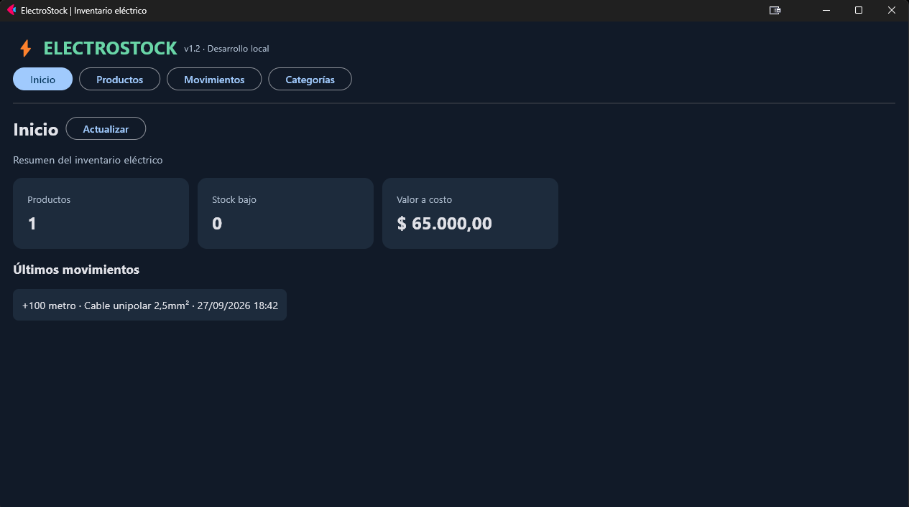

# ⚡ ElectroStock

### Sistema de inventario especializado en materiales eléctricos

**Python · FastAPI · PostgreSQL · SQLAlchemy · Flet**  
**Estado:** prototipo funcional de desarrollo local · **Versión actual:** v1.2

ElectroStock es un proyecto de desarrollo y aprendizaje orientado a la administración de materiales eléctricos. Su objetivo es registrar productos, controlar sus existencias y conservar un historial de movimientos, considerando las diferencias entre un cable que se vende por metros y una protección eléctrica que se vende por unidades.

Lo desarrollo por etapas, documentando tanto las funcionalidades como las decisiones técnicas. La intención es construir una base mantenible que, más adelante, permita incorporar compras, ventas, varios usuarios y clientes para PC y dispositivos móviles.

> **Alcance actual:** funciona como prototipo local. No está preparado para exponerse a Internet ni dispone todavía de autenticación, facturación o aplicación Android distribuible.



## Contenido

- [El problema](#el-problema)
- [Funcionalidades actuales](#funcionalidades-actuales)
- [Arquitectura y decisiones](#arquitectura-y-decisiones)
- [Evolución del proyecto](#evolución-del-proyecto)
- [Instalación local](#instalación-local)
- [Pruebas](#pruebas)
- [Estructura](#estructura)
- [Documentación y próximas fases](#documentación-y-próximas-fases)

## El problema

Un inventario genérico no siempre refleja cómo trabaja un negocio de electricidad: los cables requieren sección, color y longitud; las termomagnéticas necesitan corriente nominal, polos y curva; una compra en rollos o cajas debe convertirse en metros o unidades sin perder el dato original.

ElectroStock busca resolver estas situaciones sin sacrificar la trazabilidad. Por eso, el **stock se guarda en una unidad base** y cada entrada o salida genera un movimiento histórico en lugar de sobrescribir cantidades sin explicación.

## Funcionalidades actuales

| Módulo | Qué permite hacer |
| --- | --- |
| Panel de inicio | Consultar cantidad de productos, alertas de stock bajo, valoración a costo y movimientos recientes. |
| Productos | Dar de alta, buscar y editar productos sin modificar directamente el historial de existencias. |
| Categorías | Usar categorías eléctricas predefinidas y crear otras con campos propios. |
| Especificaciones técnicas | Registrar atributos diferentes según la categoría: sección, amperaje, polos, curva, potencia, etc. |
| Unidades y presentaciones | Diferenciar metros y unidades, configurar rollos o cajas y convertir las entradas y salidas. |
| Movimientos | Registrar entradas y salidas con motivo, responsable, fecha, cantidad original y unidad base. |
| API REST | Consultar y registrar información mediante endpoints documentados con FastAPI. |
| Persistencia | Almacenar datos en PostgreSQL; conservar los registros al cerrar y volver a abrir la aplicación. |

**Ejemplo:** una entrada de **2 rollos de 100 m** registra **200 metros** en el inventario, pero conserva también que el movimiento original fue de 2 rollos. Para piezas individuales, se rechazan cantidades fraccionarias y el sistema no permite existencias negativas.

La captura muestra el dashboard de una prueba local. Las cantidades y los importes son ilustrativos: no representan datos comerciales reales.

## Arquitectura y decisiones

```text
              Flet (interfaz de escritorio)
                           |
                     Solicitudes HTTP
                           |
                     FastAPI (API REST)
                           |
              Servicios y reglas de inventario
                           |
                     SQLAlchemy
                           |
                      PostgreSQL
```

| Tecnología | Por qué la elegí |
| --- | --- |
| **Python** | Para profundizar en el lenguaje mientras desarrollo un proyecto aplicado. |
| **Flet** | Para construir una interfaz en Python y mantener abierta la posibilidad de otras plataformas sin afirmar que Android ya está implementado. |
| **FastAPI** | Para separar la interfaz de las reglas de negocio y ofrecer una API reutilizable a futuros clientes. |
| **PostgreSQL** | Para centralizar la persistencia y evitar que el diseño dependa de archivos locales de una única interfaz. |
| **SQLAlchemy** | Para organizar los modelos y las operaciones sobre la base de datos desde el backend. |
| **Git y GitHub** | Para registrar cambios, documentar decisiones y mantener un historial visible del desarrollo. |

La interfaz **no se conecta directamente a PostgreSQL**: solicita datos a FastAPI. Las credenciales de la base de datos permanecen en el entorno local del backend y no se publican en el repositorio.

Más detalles: [arquitectura](docs/arquitectura.md) y [decisiones técnicas](docs/decisiones-tecnicas.md).

## Evolución del proyecto

| Etapa | Objetivo y resultado | Estado |
| --- | --- | --- |
| Prototipo inicial | Ejercitar el inventario, el registro de productos y el historial. | Realizada |
| **v1.1** | Separar interfaz, API y base de datos; conseguir una primera operación de stock persistente. | Realizada |
| **v1.2** | Incorporar categorías y atributos eléctricos, unidades base, presentaciones y una migración que conserve información anterior. | Implementada; pruebas locales adicionales en curso |
| **v1.3** | Consolidar ficha de producto, validaciones, experiencia de uso y pruebas con PostgreSQL real. | Planificada |
| Versiones siguientes | Proveedores, compras, ventas, clientes, seguridad, reportes y acceso móvil. | Planificadas |

**Por qué desarrollo por fases:** primero necesito comprobar la persistencia y la integridad del stock. Sobre esa base puedo añadir funciones administrativas sin mezclar errores de distintas áreas. En la v1.2 prioricé conservar datos existentes antes que reemplazar completamente la base.

El desarrollo detallado está en el [diario del proyecto](docs/diario-desarrollo.md). Las próximas tareas se organizan en [ROADMAP.md](ROADMAP.md) y los cambios por versión se anotan en [CHANGELOG.md](CHANGELOG.md).

## Instalación local

Esta guía está pensada para **Windows, Python 3.12 y PostgreSQL**. La versión actual se ejecuta localmente, con el backend y la interfaz en procesos separados.

1. Cloná el repositorio y entrá en la carpeta del proyecto:

   ```powershell
   git clone https://github.com/gonzag320/ElectroStock.git
   cd ElectroStock
   ```

2. Creá el entorno virtual e instalá las dependencias:

   ```powershell
   python -m venv .venv
   .\.venv\Scripts\python.exe -m pip install -r backend\requirements.txt -r frontend\requirements.txt
   ```

3. Creá la base `electrostock_db` en tu instancia local de PostgreSQL. Copiá el archivo de ejemplo y editá **solo tu copia local**:

   ```powershell
   Copy-Item backend\.env.example backend\.env
   notepad backend\.env
   ```

   Completá la conexión de PostgreSQL en `backend/.env`. Si el frontend necesita una dirección de API diferente, copiá también `frontend/.env.example` como `frontend/.env` y ajustá `API_URL`. Nunca subas archivos `.env` con credenciales reales.

4. En la **primera terminal**, desde la raíz del proyecto, verificá la conexión y arrancá el servidor:

   ```powershell
   .\.venv\Scripts\python.exe -m backend.diagnostico
   .\.venv\Scripts\python.exe -m uvicorn backend.main:app --host 127.0.0.1 --port 8000
   ```

5. En una **segunda terminal**, sin cerrar la primera, iniciá la interfaz:

   ```powershell
   .\.venv\Scripts\python.exe -m frontend.main
   ```

La documentación interactiva está en **http://127.0.0.1:8000/docs** y la comprobación de la base de datos en **http://127.0.0.1:8000/api/salud-db**.

También hay archivos `.bat` para instalación y arranque en Windows. Si ya utilizabas v1.1 con datos reales, **hacé un respaldo verificado antes de iniciar v1.2**: el backend ejecuta una migración aditiva al arrancar. Consultá las instrucciones de actualización y respaldo del proyecto antes de migrar.

## Pruebas

Las pruebas automatizadas están en `tests/`. Para instalar sus dependencias y ejecutarlas:

```powershell
.\.venv\Scripts\python.exe -m pip install -r requirements-dev.txt
.\.venv\Scripts\python.exe -m pytest -q
```

La suite emplea una base SQLite temporal para pruebas aisladas. **Superar estas pruebas no equivale a validar automáticamente una instalación real de PostgreSQL ni el renderizado de Flet**: esas comprobaciones deben realizarse por separado. Ver [PRUEBAS_API.md](PRUEBAS_API.md) para conocer los endpoints y los ejemplos.

## Estructura

```text
ElectroStock/
├── backend/                  # API, modelos y reglas de inventario
│   ├── database/             # Conexión, modelos y migración de datos
│   ├── routers/              # Endpoints REST
│   └── services/             # Operaciones y validaciones
├── frontend/                 # Aplicación Flet y cliente HTTP
│   └── services/
├── tests/                    # Pruebas automatizadas
├── scripts/                  # Respaldo y utilidades
├── backups/                  # Respaldos locales ignorados por Git
├── docs/                     # Arquitectura, decisiones y diario
├── ROADMAP.md                # Plan de próximas fases
├── CHANGELOG.md              # Cambios implementados por versión
└── README.md                 # Presentación e instalación
```

## Documentación y próximas fases

Este repositorio intenta reflejar tanto **el resultado** como **el proceso de desarrollo**:

- [ROADMAP.md](ROADMAP.md): prioridades, fases y criterios de finalización.
- [Arquitectura](docs/arquitectura.md): cómo se comunican los componentes y dónde vive cada responsabilidad.
- [Decisiones técnicas](docs/decisiones-tecnicas.md): por qué tomé determinadas decisiones y qué alternativas evalué.
- [Diario de desarrollo](docs/diario-desarrollo.md): problema, implementación, pruebas, aprendizajes y próximos pasos de cada versión.
- [CHANGELOG.md](CHANGELOG.md): qué cambió efectivamente en cada entrega.
- [PRUEBAS_API.md](PRUEBAS_API.md): endpoints y ejemplos técnicos.

**Próximo objetivo:** consolidar la v1.2 mediante pruebas reales y trabajar en la ficha de producto de v1.3 antes de incorporar compras y ventas.

---

**Autor:** Gonzalo · [GitHub: gonzag320](https://github.com/gonzag320)  
**Licencia:** consultá el archivo [LICENSE](LICENSE) del repositorio.
